# Procurement & Customer Satisfaction Analysis | Excel & Power BI

## Overview
**AutoFix Services Oy** is a Netherlands-based automobile maintenance company servicing passenger vehicles, light trucks, and fleet cars. The company sources over 50 types of automotive spare parts from multiple international suppliers (Europe, UK, USA, Japan).  

This project performs an integrated **procurement and customer satisfaction analysis**, using Excel for data cleaning, calculations, and correlation checks, and Power BI for interactive dashboards and KPI visualization. The analysis identifies cost-saving opportunities in supplier selection, highlights high-volatility product categories, and evaluates customer satisfaction and loyalty (NPS), providing actionable insights for data-driven decision making.

## Table of Contents
1. [Overview](#overview)
2. Part A – Procurement Analysis
   - [Business Problem](#part-a--procurement-business-problem)
   - [Analysis & Key Results](#part-a--analysis--key-results)
   - [Recommendations](#part-a--recommendations)
3. Part B – Customer Satisfaction Analysis
   - [Business Problem](#part-b--customer-satisfaction-problem)
   - [Analysis & Key Results](#part-b--analysis--key-results)
   - [Recommendations](#part-b--recommendations)
4. [Next Steps](#next-steps)
5. [What I Learned](#what-i-learned)
6. [Project Files](#project-files)
7. [Screenshots](#screenshots)
8. [Repository Structure](#repository-structure)

---

## Part A – Procurement Analysis

### Business Problem
Manual procurement analysis was inefficient and prone to error due to large data volume. The company needed answers to:

- Which suppliers offer the lowest prices per product?  
- Which suppliers have stable vs volatile pricing?  
- Potential savings if switching suppliers?  
- Does lead time or spend impact customer satisfaction (NPS)?  
- Which product categories drive the most spend?  

A **data-driven approach** was required to evaluate suppliers based on cost, stability, and overall impact on spend while connecting procurement performance to customer outcomes.

---

### Tools & Skills
Excel (Pivot Tables, VLOOKUP, MINIFS, weighted calculations, regression, ANOVA) | Power BI (Dashboards, slicers, charts)

### Analysis & Key Results
**Data Preparation**  
- Extracted and transformed data from **100 PDF invoices**, each containing 10 line items, resulting in ~1,000 rows.  
- Standardized fields including unit price, quantity, total line value, supplier, and product details to ensure consistency for analysis.

**Master Dataset Screenshots**  
- 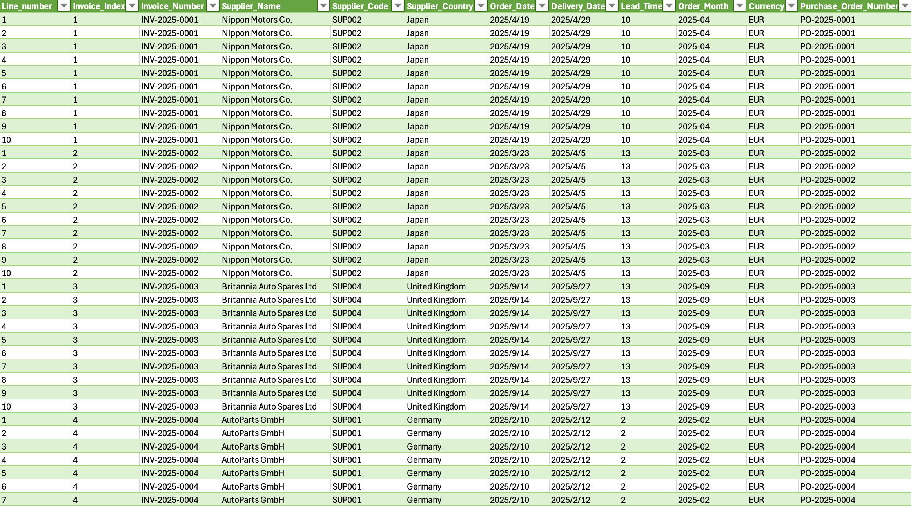  
- 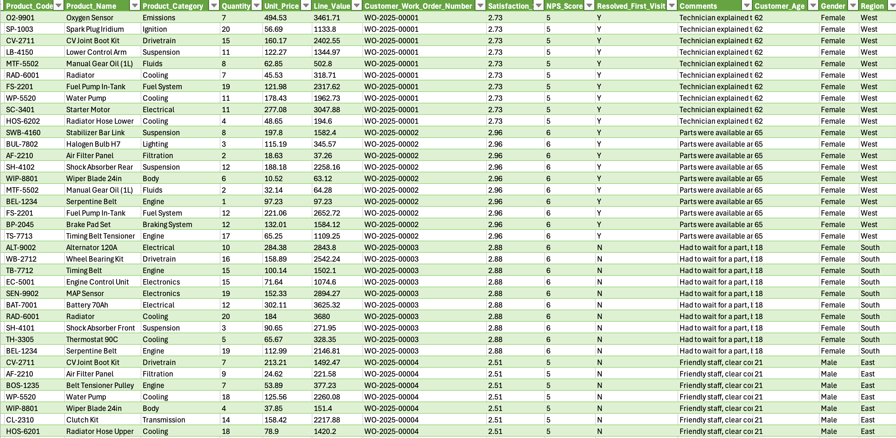  
- 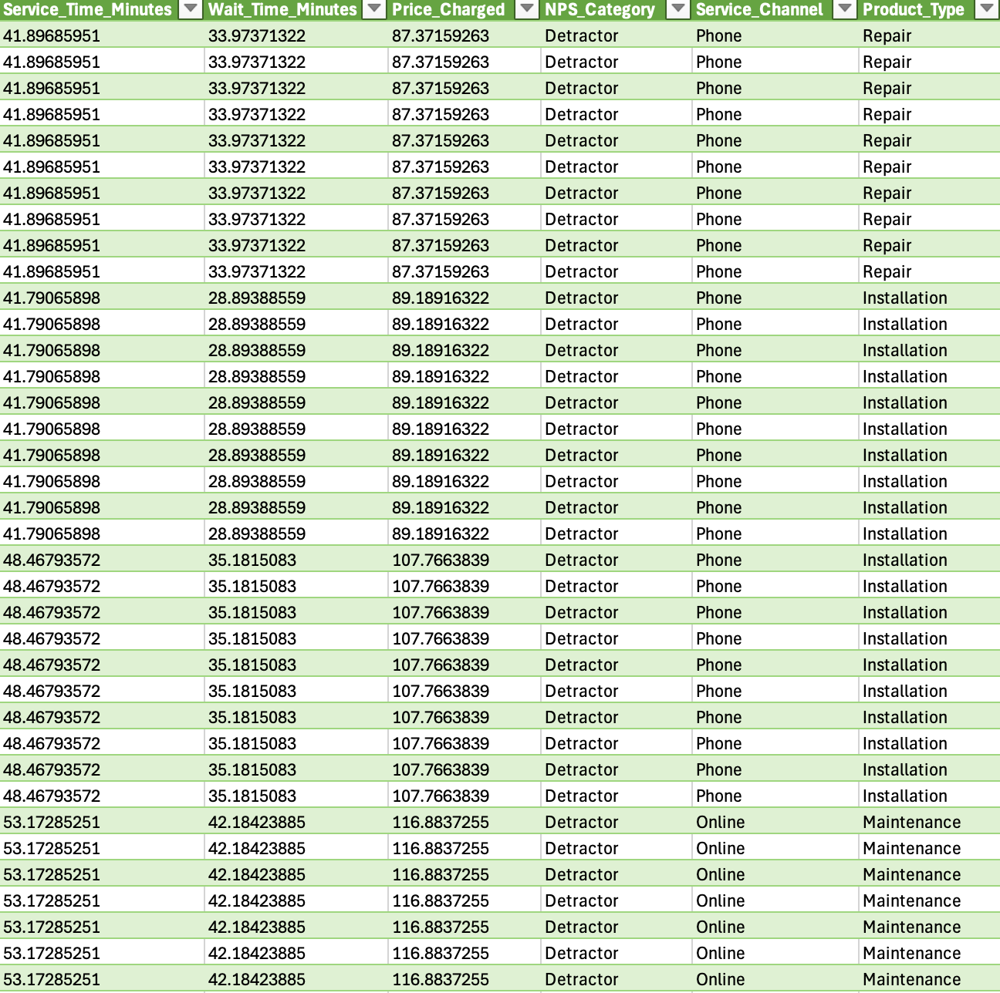

- **Average Price & Volatility** – Pivot tables and box plots highlight high/low prices and category-level volatility. Categories with highest volatility: **Emissions, Transmission, Electronics**.  
  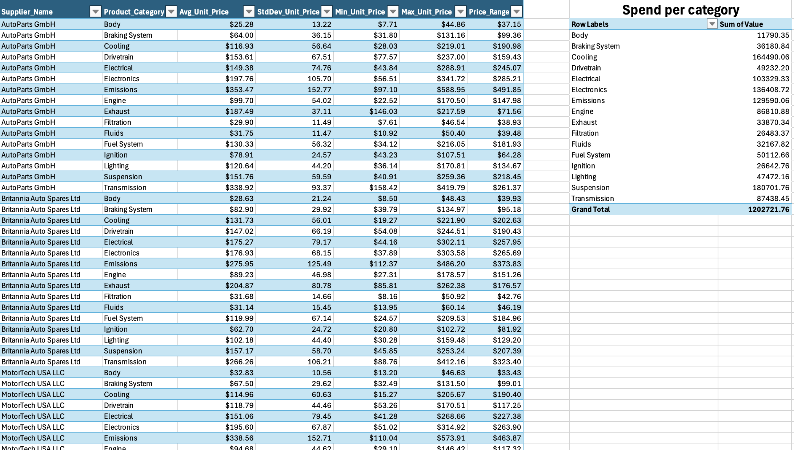  
  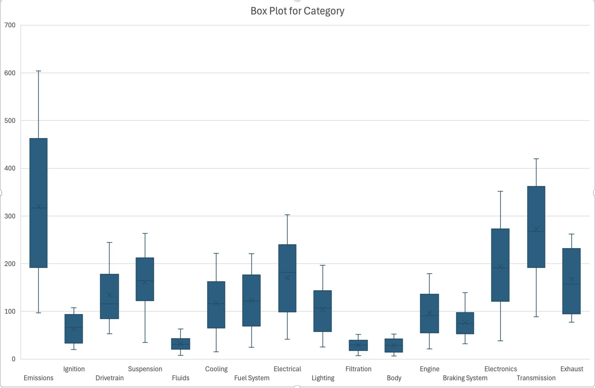

- **Weighted Average Price & Supplier Ranking** – Weighted averages combine unit price and quantity to identify suppliers with the greatest impact on total spend. Overall cheapest supplier: **MotorTech USA LLC**.  
  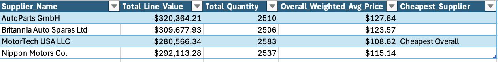

- **Savings Simulation** – Estimated potential savings by switching to the cheapest suppliers: **$136,439**.  
  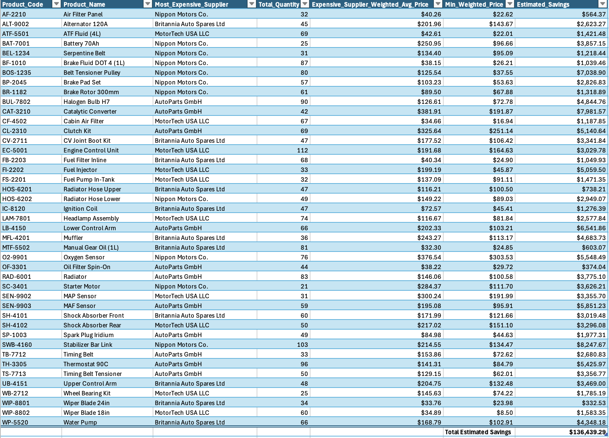

- **Statistical Checks** – Regression and ANOVA conducted in **Excel** to assess relationships between lead time, spend, and customer satisfaction/NPS.  

- **Interactive Dashboard in Power BI** 

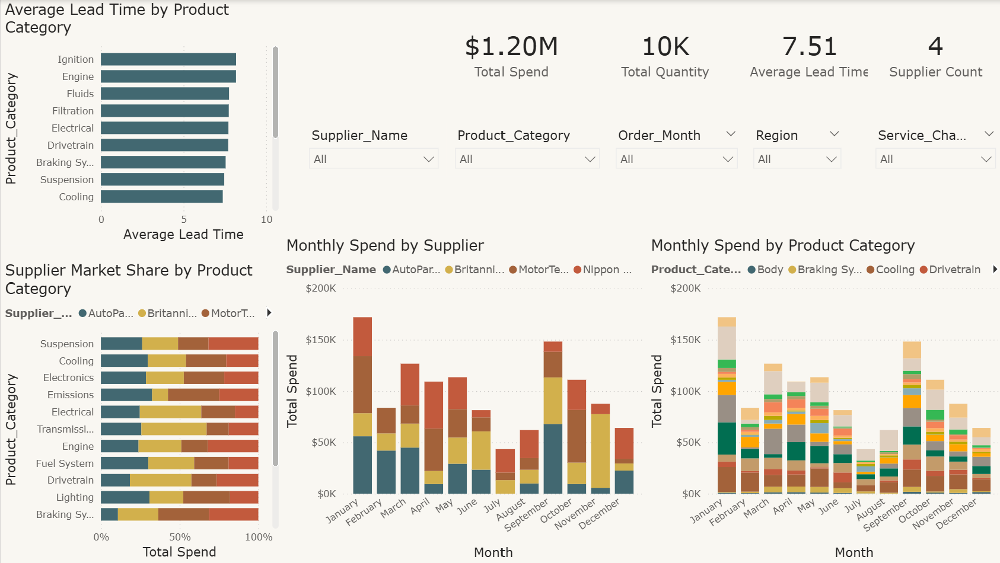 
To complement the Excel analysis, a **Power BI dashboard** was created for visual exploration of supplier and category performance:

- Average Lead Time by Product Category – Identifies categories with longer or shorter lead times to assess operational efficiency.  
- Supplier Market Share by Product Category – Shows each supplier's contribution to total spend in each category, highlighting reliance on specific suppliers.  
- Monthly Spend by Supplier & Product Category – Interactive stacked bar charts to visualize trends and seasonal spending patterns.  
- Key Metrics Cards – Summarize total spend, total quantity, average lead time, and supplier count for a quick overview.  
- Slicers – Allow filtering by supplier, product category, month, or region for detailed analysis.

These visualizations make it easier to detect trends, outliers, and opportunities for cost savings that may not be obvious from Excel pivot tables alone.

---

## Recommendations
- Prioritize **MotorTech USA LLC** for total spend reduction, particularly in high-volume categories.  
- Monitor high-volatility categories (Emissions, Transmission, Electronics) for price fluctuations.  
- Re-evaluate suppliers for low-volume but high-price parts to capture additional savings.  
- Integrate procurement monitoring into monthly dashboards for continuous oversight.

---

## Part B – Customer Satisfaction Analysis

### Business Problem
AutoFix Services Oy wanted to understand customer satisfaction and loyalty to improve service quality, efficiency, and retention. The analysis identifies key drivers of satisfaction, evaluates loyalty using NPS, and highlights actionable insights for management.

---

### Tools & Skills
- **Power BI** – Interactive dashboards with KPIs, scatter plots, and slicers  
- **DAX** – Created measures using aggregate functions and conditional logic (IF)  
- **Power Query** – Cleaned, merged, and preprocessed datasets for analysis  
- **Excel** – Correlation analysis, pivot tables, and thematic coding of customer comments  

---

### Analysis & Key Results
**Customer Dashboard (Power BI)**  
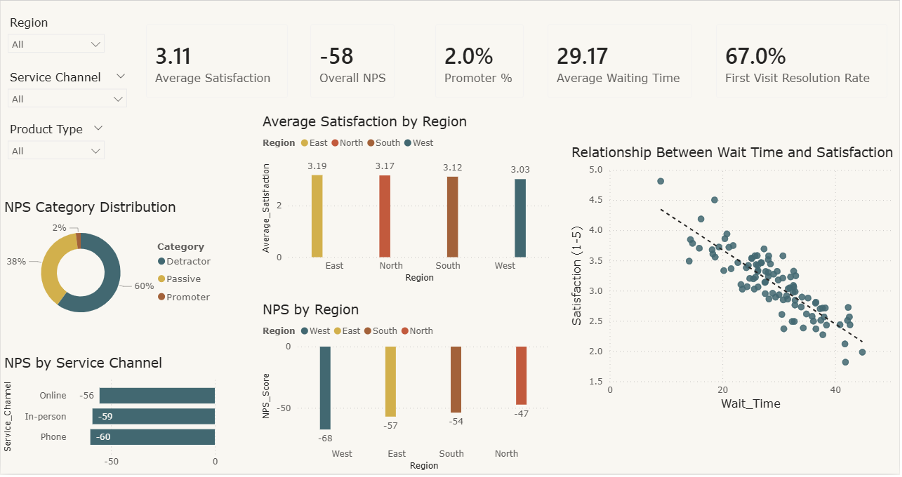

- Overall satisfaction is low (3.11/5) with NPS of -58, highlighting a predominantly detractor base.  
- **Excel Supporting Screenshots:**  
  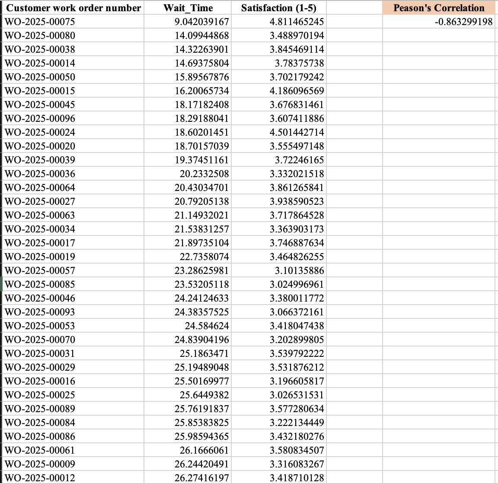 
  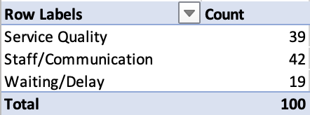

- Wait times negatively correlate with satisfaction (r = -0.8632).  
- Customer comments indicate communication, service quality, and waiting/delays are the main areas needing improvement.  
- Regional & Channel Insights:  
  - North region & Online channel perform best  
  - West region & Phone channel perform worst  

---

### Recommendations
- Reduce waiting times to improve overall satisfaction.  
- Enhance staff communication and explanations to customers.  
- Maintain high service quality and first-time resolution rates.  
- Focus on weaker segments: West region and Phone channel.

---

## Next Steps

If I had more time, I would improve this project by:

1. Connecting customer satisfaction data with procurement performance to explore how supplier choices impact service outcomes.  
2. Adding predictive measures, such as forecasting future supplier pricing or potential NPS changes based on operational improvements.  
3. Automating the workflow from PDF invoice extraction to dashboard updates for real-time insights.

---

## What I Learned

Through this project, I practiced the end-to-end workflow for both procurement and customer satisfaction analytics. I learned how to:

- Extract and clean multi-page PDF invoices, standardize fields, and merge line-level and header-level data.  
- Build Excel pivot tables, weighted average calculations, and box plots to derive actionable procurement insights.  
- Design interactive Power BI dashboards and write DAX measures for KPIs like NPS and service metrics.  
- Analyze correlations between operational factors (e.g., wait time) and customer satisfaction in Excel.  
- Translate technical data work into business-focused insights and recommendations, a key skill for data analyst roles.  

---

## Project Files

| File | Description |
|---|---|
| `01_master_data_analysis.xlsx` | Master dataset containing invoice line data, procurement calculations, and part-level analysis |
| `02_partA_procurement_dashboard.pbix` | Power BI file for Procurement Analysis dashboard |
| `03_partB_customer_dashboard.pbix` | Power BI file for Customer Satisfaction Analysis dashboard |
| `04_partB_correlation_comments.xlsx` | Excel file with correlation analysis and pivot tables for customer comments |
| `README.md` | Project overview, methodology, results, and recommendations |
| `screenshots/` | Folder containing all screenshots used in the README |